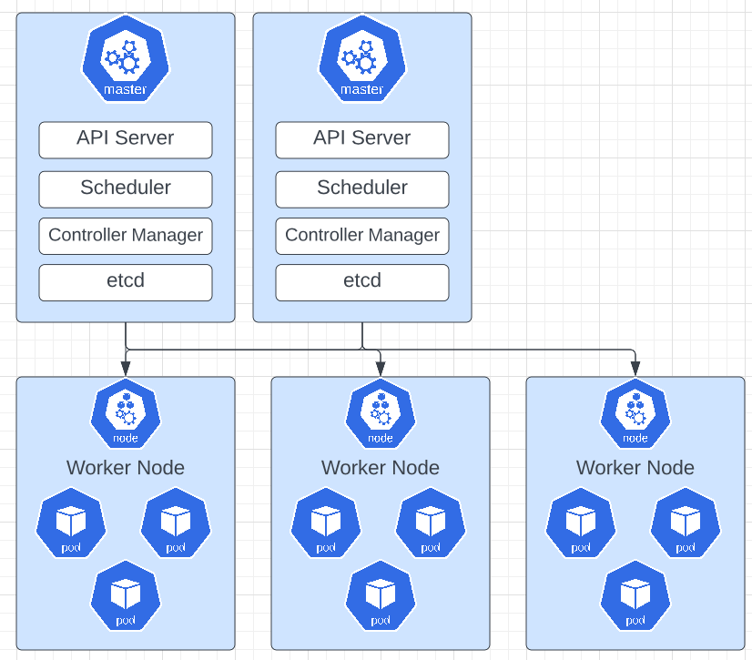

# K8s Architecture

## Node Processor

### Worker Machine in K8s Cluster

- Each node has multiple Pods on it
- 3 processes must be installed on every node for the cluster node to perform properly.
  - **Container runtime**
    - This independent process uses docker or container d
  - **Kubelet**
    - Container runtime is ran by **kubelet**
    - **Kubelet** interacts with both the container and node
    - **Kubelet's** job is to start the pod with a container inside and then provision the resources for that pod.
  - **Kube Proxy**
    - **Kube Proxy** forwards the requests using services to and from pods.
    - **Kube Proxy** does not just send requests to any pod, it is smart enough to send the request to pods that are in the same node.
- Worker Nodes do the actual work

### Master Processes

- So, how does interact with this cluster?
  - How do we:
    - schedule pods?
    - monitor pods?
    - re-schedule or re-start pods?
    - join a new Node to the cluster?
- This is all done through the master node.
- There are 4 process inside the master node or control plane:
  - **API Server**:
    - You use a client service to interact with the master node.
      - K8s GUI
      - CLI through kubectl
      - K8s API
    - This works a cluster gateway and acts as a gatekeeper for authentication.
    - API process: User request --> API server --> validates request --> other processes --> makes changes to the pod.
  - **Scheduler**:
    - A k8s API call for a new pod uses the Scheduler to add or restart a pod.
    - Scheduler decides, based on resources, which node the new pod should be scheduled.
    - Scheduler uses kubelet to start pods on nodes
    - Process: User request --> API server --> Scheduler --> Kubelet --> pod created.
  - **Controller Manager**:
    - Controller Manager is used to detect when pods die and they need to be rescheduled ASAP.
    - It detects cluster state changes (pods going into a down state) and recovers the state ASAP.
    - Process: Controller Manager --> Scheduler --> Kubelet --> Pods are restarted.
  - **etcd**:
    - etcd is a key-value store of a cluster's state information.
    - Essentially is the cluster's brain.
    - Cluster changes get stored in key-value store
    - API Server, Scheduler, and Controller Manager get's it's information from etcd to run such processes as queries for cluster health, resources available, or cluster state changes.
    - Application data is NOT store in etcd.
    - Each cluster can have multiple master nodes.

### Example Cluster Set-Up

- In this example 2 Master Nodes (Control Plane) and 3 Worker Nodes
- Hardware Resources:
  - Master Nodes are more important than worker nodes, however they require less hardware resources (CPU, RAM, storage)
  - Worker Nodes are less important, but have higher workloads thus require more hardware resources.
- You can scale this up and down as you see fit.
- To add a new Master Node:
  - Get new bare server
  - Install all the master / worker node processes
  - Add it to the cluster

