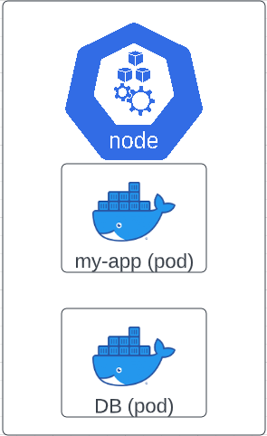
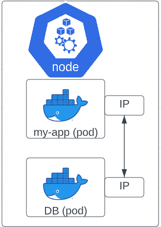
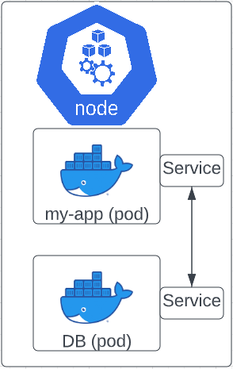
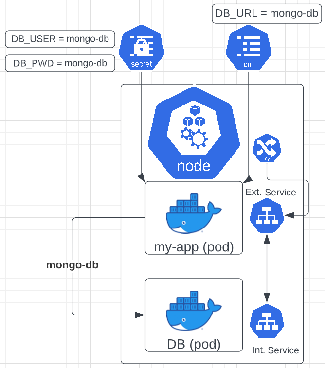
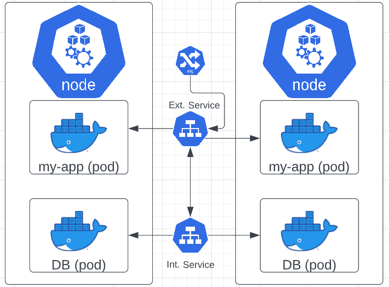

# Main K8s Components

## Node and Pod

- Node = Virtual or physical machine
- Pod = Smallest unit in K8s
  - Abstraction over container
  - Usually 1 Application per Pod

### How do pods communicate with each other?

- Each pod gets its own internal IP address.
- Pods are ephemeral (they can die easily)
- Each time a pod dies, it is recreated with a new IP address.
  - This is inconvenient because you have to update the ip in the application pod each time.
  - However, a service can remedy this.

## Service and Ingress

- Permanent IP address that can bee added to each pod.
- Lifecycle of Pod and Service are not connected.
  - So if the pod dies, you do not have to change the update the service's endpoint.

### External vs Internal Service

- External service is an IP that can be reachable by the public IP with port number.
  - In the example above, my-app will have an external service to be reachable.
  - However, if you want the external service to be reachable by URL, you will need to create an Ingress.
- Internal service is a type of service on creation of the pod. (ex: private IP for DB)

### Ingress

- An Ingress sits in front of the service to forward the request to the service.
  - Ex. A request for my-app's URL will hit the ingress first and then forward the request to the IP with the protocol to bring up my-app in the browser.

## ConfigMap and Secrets

- Scenario: Let's say the database's URL is mongo-db-service in the build. However, you need to change the URL to mongo-db instead. For this to take place, you will have to follow these steps manually:
  - Rebuild the application with a new image
  - Push to repo
  - Pull that image in your pod and restart.
- To solve this, K8s uses ConfigMap (CM)

### ConfigMap (CM)

- External Configuration of your application (DB URL or name)
- You connect the CM to the application pod

### Secrets

- If the DB username or password changes, you **DO NOT** put this data in the CM.
  - CM is for non-confidential data only!
- Used to store secret data
- Store with base64 rather than plain text
- It's better to use third-party tools to secure your K8s secrets.
- You can reference Secret in Deployment/Pod
  - You can also use it as environment variables or as a properties file.

## Volume (Data Storage)

- If the DB pod fails and has to restart, you will loose all of the data inside the pod.
- You can use K8s Volume to store data from the pod on the hard drive.
- Storage on the local machine
- Or remote, outside of the k8s cluster. (Cloud or somewhere else.)
- This persistance volume will be attached and data will be retrieved if the pod has to restart.
- You can think of a Volume as an external hard drive that is attached to the k8s cluster.
- K8s does not manage data. You will need to make sure you have backups, replicating and having a proper data management procedure.

## Deployment & StatefulSet

- If the my-app pod dies for whatever reason, currently with this set up, you would have down-time of the application which is not ideal. However, you can create a replica (clone of the node) using services (which is also a loadbalancer) and k8s deployment.

### Deployment

- Deployment is the blueprint for pods.
- In the real world, you would not be directly replicating or creating pods. Instead you would be creating Deployments.
- Deployment is an abstraction of pods.
- So now if the application dies, it the service will forward all the traffic to the replicated pod, until both pods are up.
- Deployments are used for stateLESS Apps

### StatefulSet

- So, what if the DB goes down?
- You cannot use a deployment to replicate a DB because it has volumes attached. If there are two replicated DBs writing to one volume, then you could have data inconsistencies.
- This is where StatefulSet comes in to help.
- StatefulSet are used for stateFUL Apps or Databases.
- StatefulSet is much more difficult than Deployments
- This is why it's important to use remote volumes outside the cluster.

## Daemon Set

- Let's say that we collect logs from the pods on each node.
- We would need to run a log collector application on each node, or we could use kube-proxy on each node.
- We would create Deployments with replica count 2 to match Nodes in our cluster.
- If we wanted to add two new nodes to our cluster, we would just adjust the replica number.
- If we remove a node, we would again need to adjust to replica number again.
- With Deployment, we also can't ensure that Pods are equally distributed.
- So, how do we ensure that Pods are equally distributed?
- We would use a DaemonSet in this case.
- **DaemonSets** calculates how many Replicas are needed based on existing Nodes and then adds or removes those replicas.
- Deploys just 1 replica per node.
- When nodes are added, pods are automatically added to them
- When Nodes are removed, those pods are garbage collected
- With **DaemonSets**, there is no need to define replica count because it automatically scales up or down.